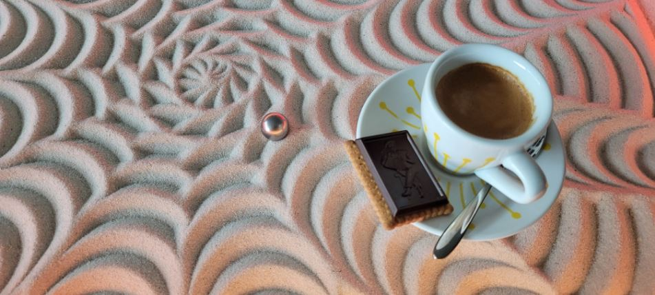

Maker Media GmbH

***

# Der IKEA-Hack Sandmaltisch

Einer rollenden Kugel im Sand zuzuschauen, ist mystisch und entspannend zugleich. Den dadurch entstehenden Sandbildern kann sich der Betrachter kaum entziehen. Unser Autor erklärt in diesem zweiten Teil unseres Sandmaltisch-Projekts, wie mit viel kreativer Inspiration spielend einfach neue Sandbilder entstehen.

 

Den vollständigen Artikel gibt es in der Make 5/24 ab Seite 86.

Teil 2.
